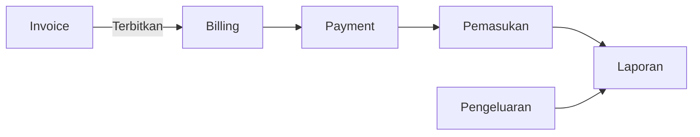
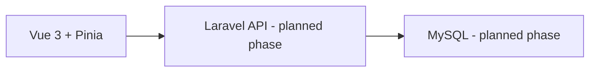

<div align="center">
  

# Sistem Invoicing & Billing

**PT. Ruang Kreasi Aplikasi**

Sistem internal berbasis web untuk pengelolaan invoice, billing, pembayaran, pemasukan, pengeluaran, dan laporan keuangan sederhana.


</div>

## Project Status

| Area | Status |
| --- | --- |
| Frontend UI/UX | ✅ Complete |
| Frontend business-flow demo | ✅ Complete |
| Backend Laravel | ⏳ Planned |
| Database integration | ⏳ Planned |
| End-to-end production QA | ⏳ Planned |

## Tentang Project

Project Kerja Praktik: **Rancang Bangun Sistem Invoicing dan Billing Berbasis Web pada PT. Ruang Kreasi Aplikasi**. Aplikasi ini menyatukan proses pembuatan invoice, monitoring billing, pencatatan pembayaran, pemasukan, pengeluaran, serta laporan sederhana dalam satu sistem internal.

## Fitur Utama

- **Dashboard** — ringkasan invoice, tagihan, pemasukan, pengeluaran, dan grafik periode.
- **Master Data** — klien, vendor, produk & layanan, serta rekening.
- **Invoice** — draft, terbitkan, batalkan, item invoice, penomoran, preview A4, dan template invoice.
- **Billing & Payment** — sisa tagihan, pembayaran parsial/multiple, status pembayaran, dan validasi overpayment.
- **Keuangan** — pemasukan dari pembayaran, pemasukan manual, pengeluaran, rekening sumber, dan transfer.
- **Laporan** — buku kas debit/kredit, invoice, pembayaran, pemasukan, dan pengeluaran.
- **Pengaturan** — data perusahaan, template invoice, penomoran invoice, serta pengguna & hak akses.

## Alur Bisnis



Invoice diterbitkan tidak otomatis menjadi pemasukan. Pemasukan invoice dicatat saat pembayaran diterima.

## Business Rules Utama

- Billing = total invoice − total pembayaran.
- Satu invoice dapat memiliki beberapa pembayaran.
- Overpayment ditolak; invoice draft tidak masuk billing aktif.
- Pengeluaran terpisah dari billing dan memakai rekening sumber.
- Laporan memakai konsep debit/kredit sederhana.

## Teknologi

- Laravel 12
- Vue.js 3, Vue Router, dan Pinia
- MySQL (fase integrasi berikutnya)
- Vite dan Tailwind CSS

## Arsitektur



Frontend saat ini memakai data demo terstruktur. API Laravel dan integrasi MySQL adalah fase pengembangan berikutnya.

## Struktur Project

```text
.
├── app/                 # Laravel application
├── config/              # Framework configuration
├── database/            # Future database schema and seeders
├── docs/                # Product and technical contracts
├── public/              # Runtime favicon, fonts, and invoice images
├── resources/           # Vue frontend and Blade views
├── routes/              # Laravel routes
├── storage/
├── tests/
├── artisan
├── composer.json
├── package.json
└── vite.config.js
```

## Development Setup

```bash
composer install
npm install
copy .env.example .env
php artisan key:generate
# Konfigurasikan database pada .env sebelum menjalankan migration.
npm run dev
php artisan serve
```

## Catatan Pengembangan

Dokumen kebutuhan, aturan bisnis, kontrak API, dan keputusan teknis berada di [`docs/`](docs/). Referensi UI dan asset sumber original yang digunakan selama implementasi frontend diarsipkan pada tag [`frontend-full-reference-2026-08-28`](https://github.com/zri12/Sistem-Invoicing-Billing-Implementasi/tree/frontend-full-reference-2026-08-28).

Current development: frontend implementation complete; backend dan integrasi database merupakan fase berikutnya.

## Developer

| Nama | Tanggung Jawab |
| --- | --- |
| Fazri Lukman Nurrohman | Frontend & Project Foundation |
| Fahmi Nashruddin | Backend & Database |

## Environment

File `.env` tidak disimpan di repository. Gunakan `.env.example` sebagai baseline konfigurasi lokal.

<div align="center">
  Developed for PT. Ruang Kreasi Aplikasi
</div>
